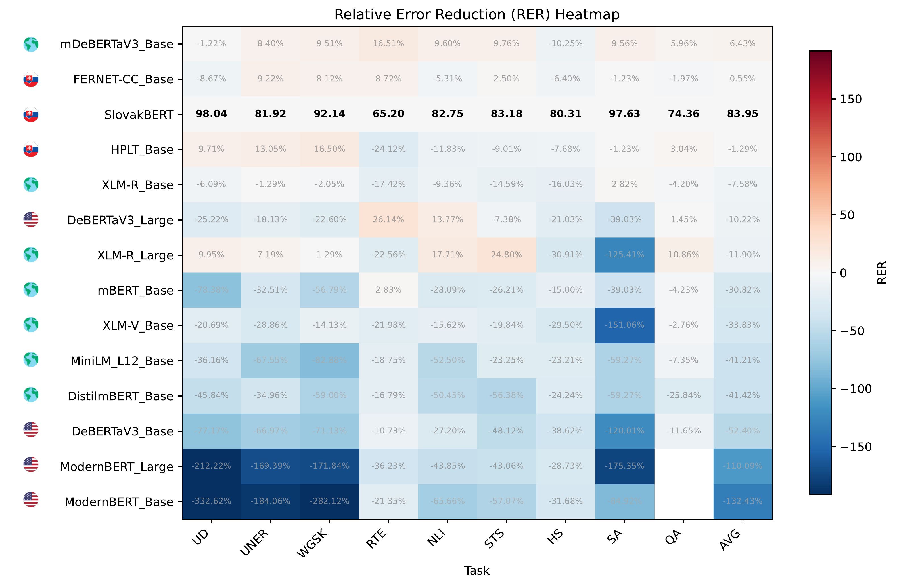

# skLEP: A Slovak General Language Understanding Benchmark

skLEP is a GLUE-style benchmark for evaluating Slovak natural language understanding (NLU) models.

## Current snapshot



Find more in the paper and explore the full results: https://aclanthology.org/2025.findings-acl.1371/

## Dataset

The skLEP dataset is available on Hugging Face: 🤗 [slovak-nlp/sklep](https://huggingface.co/datasets/slovak-nlp/sklep)

## Setup

This project uses `uv` for environment management. If you don't have `uv` installed, you can find installation instructions [here](https://docs.astral.sh/uv/getting-started/installation/).

To create the virtual environment and install the necessary dependencies, run the following command:

```bash
uv pip install .
```

## Evaluation

Before running the evaluation, make sure to activate the virtual environment:

```bash
source .venv/bin/activate
```

The evaluation script `sklep_run.sh` is used to run the benchmark tasks.

### Usage

The script can be run with various arguments to customize the evaluation:

- `--tasks`: A comma-separated list of tasks to run. Available tasks are: `qa`, `sts`, `nli`, `rte`, `hate`, `sentiment`, `uner`, `wikigold`, `pos`. Use `all` to run all tasks.
- `--model_name`: The name or path of the Hugging Face model to evaluate.
- `--out_dir`: The directory to save the output logs and models.
- `--wandb`: The name of the Weights & Biases project to log the results.
- `--cuda`: A comma-separated list of CUDA devices to use.

### Example

To run all tasks with the `gerulata/slovakbert` model, use the following command:

```bash
./eval/sklep_run.sh \
    --tasks=all \
    --model_name=gerulata/slovakbert
```

### Parameter Sweep

The script also supports parameter sweeps for hyperparameter optimization. To enable sweep mode, use the `--sweep` flag and provide the desired hyperparameter values.

```bash
MODEL_NAME=gerulata/slovakbert ./eval/sklep_run.sh \
    --tasks=qa \
    --sweep \
    --num_train_epochs=1 \
    --learning_rate=1e-5 \
    --warmup_ratio=0.05 \
    --dropout=0 \
    --wandb=sklep_qa
```

## License

This project is licensed under the MIT License.

## Citation

If you use this benchmark in your research, please cite it's associated paper (<https://aclanthology.org/2025.findings-acl.1371/>) as follows:

```bibtex
@inproceedings{suppa-etal-2025-sklep,
    title = "sk{LEP}: A {S}lovak General Language Understanding Benchmark",
    author = "Suppa, Marek  and
      Ridzik, Andrej  and
      Hl{\'a}dek, Daniel  and
      Jav{\r{u}}rek, Tom{\'a}{\v{s}}  and
      Ondrejov{\'a}, Vikt{\'o}ria  and
      S{\'a}sikov{\'a}, Krist{\'i}na  and
      Tamajka, Martin  and
      Simko, Marian",
    editor = "Che, Wanxiang  and
      Nabende, Joyce  and
      Shutova, Ekaterina  and
      Pilehvar, Mohammad Taher",
    booktitle = "Findings of the Association for Computational Linguistics: ACL 2025",
    month = jul,
    year = "2025",
    address = "Vienna, Austria",
    publisher = "Association for Computational Linguistics",
    url = "https://aclanthology.org/2025.findings-acl.1371/",
    pages = "26716--26743",
    ISBN = "979-8-89176-256-5",
    abstract = "In this work, we introduce skLEP, the first comprehensive benchmark specifically designed for evaluating Slovak natural language understanding (NLU) models. We have compiled skLEP to encompass nine diverse tasks that span token-level, sentence-pair, and document-level challenges, thereby offering a thorough assessment of model capabilities. To create this benchmark, we curated new, original datasets tailored for Slovak and meticulously translated established English NLU resources. Within this paper, we also present the first systematic and extensive evaluation of a wide array of Slovak-specific, multilingual, and English pre-trained language models using the skLEP tasks. Finally, we also release the complete benchmark data, an open-source toolkit facilitating both fine-tuning and evaluation of models, and a public leaderboard at \url{https://github.com/slovak-nlp/sklep} in the hopes of fostering reproducibility and drive future research in Slovak NLU."
}
```
